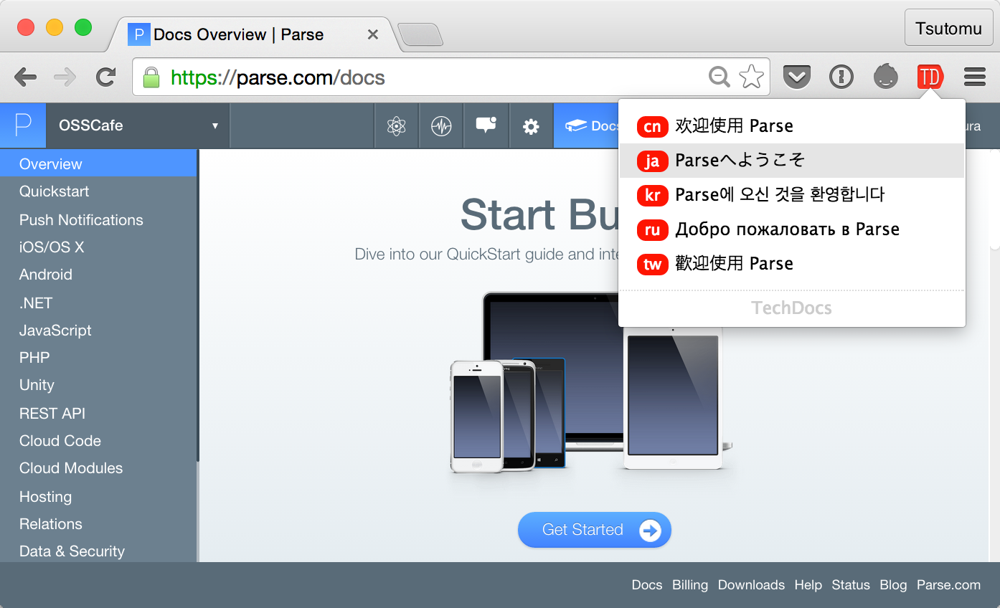

# TechDocs

The technical document curation service for you.

## Chrome Extension

Easy switching between languages.

- [Get Extension from Chrome Web Store](https://chrome.google.com/webstore/detail/techdocs/agdhoefaennmlpjlckdggihpbfacopdn) - v1.0



## Supported Documents

[Check the list of sitefile.](https://github.com/TechDocs/TechDocs/tree/gh-pages/sitefiles)

We've just started the project. Pls let us know which document you need!

- [Comment on the issue](https://github.com/TechDocs/TechDocs/issues/4)
- [Send pull request to this repo](https://github.com/TechDocs/TechDocs/pulls)

## Sitefiles

### Original Documents

The `sitefile` of the original document - typically written in English - would be like below. This example is a `sitefile` for Bootstrap.

```json
{
  "id": "bootstrap",
  "title": "Bootstrap · The world's most popular mobile-first and responsive front-end framework.",
  "url": "http://getbootstrap.com",
  "language": "en",
  "contribute": "https://github.com/twbs/bootstrap",
  "version": "3.3.*"
}
```

- `id`: The ID in TechDocs. It must be unique.
- `title`: The title of the document.
- `url`: The URL of the document. No trailing slash needed.
- `language`: The language the document written in. `en` `fr` `ja` `cn` `kr`...
- `contribute`: The URL for contributing to the document. Typically a GitHub repo.
- `version`: The version of the product.

### Translated Documents

Translated documents have two more attributes in `sitefile`.

```json
{
  "id": "bootstrap-ja",
  "title": "Bootstrap · The world's most popular mobile-first and responsive front-end framework.",
  "url": "http://www.wivern.com/bootstrap",
  "language": "ja",
  "contribute": "https://twitter.com/smokyjp",
  "version": "3.2.*",
  "origin": "bootstrap",
  "rules": [
    "getting-started/ > getting-started.html",
    "css/ > css.html",
    "components/ > components.html"
  ]
}
```

- `origin`: The ID of the original document.
- `rules`: The list of pairs of URL. `"[original] > [translated]"`


### Wildcard in URL

We can use wildcards in `rules` section.

```json
"rules": [
  "getting-started/ > getting-started.html",
  "css/ > css.html",
  "components/ > components.html"
]
```

The part of `sitefile` above would be rewritten like below. 

```json
"rules": [
  "*/ > *.html"
]
```

#### How to Process Wildcard

A wildcard `*` will be replaced into RegExp `(.+?)` internally. The code below is a pseudo code for explanation.

```javascript
var url1, url2;
var original = 'css/';
var translated = 'css.html';

url1 = original.replace(new RegExp('^(.+?)/$'), '$1.html');
// url1 == translated

url2 = translated.replace(new RegExp('^(.+?).html$'), '$1/');
// url2 == original
```

As above, wildcards are bidirectionally used - original to translate and vice versa.

### Filter in URL

Sometimes, URLs need more complicated matching. For example, the case below needs `camelCase` <--> `snake_case` conversion.

| Type | URL |
| :--- | :--- |
| original (en) | https://docs.angularjs.org/api/**ng/directive/ngBlur** |
| translated (ja) | http://js.studio-kingdom.com/**angularjs/ng_directive/ng_blur** |

The (part of) sitefile would be like below.

```json
"rules": [
  "ng/* > ng_* | camel2snake"
]
```

The pipe `|` can connect single of multiple filters.

- `camel2snake`: convert `camelCase` to `snake_case`
- `snake2camel`: convert `snake_case` to `camelCase`
- `dot2snake`: convert `dot.case` to `snake_case`
- `snake2dot`: convert `snake_case` to `dot.case`
- `replace`: convert letters to others
  
### Reversibility

Wildcards and filters are useful, but it's possible to break the reversibility of URL conversion. Please note that we have to match `original` <--> `translated`.

Basically we should keep reversibility. If it couldn't, we have **reverse** match. The next two are equivalent.

```json
"rules": [
  "ng/* > ng_* | camel2snake",
  "ng/* < ng_* | snake2camel"
]
```

